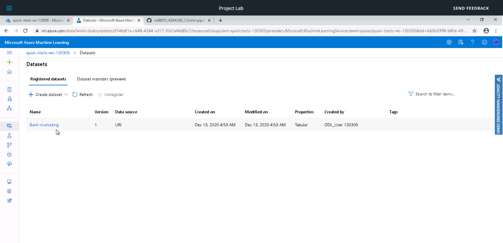
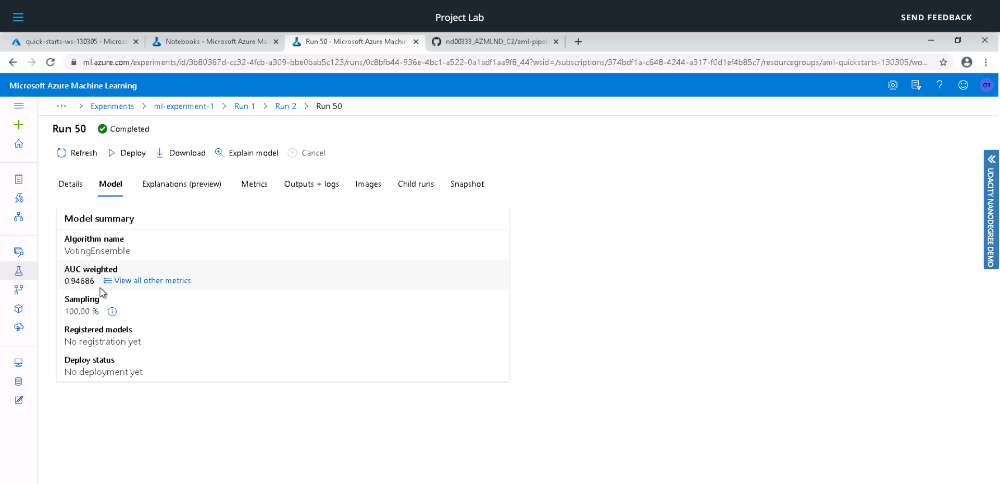
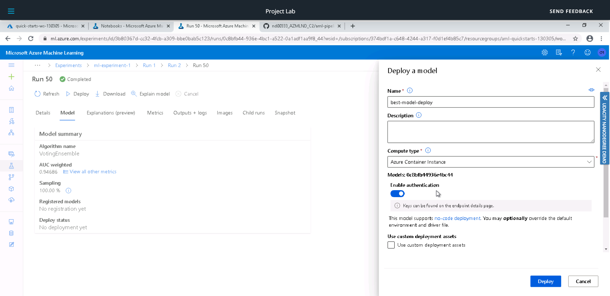
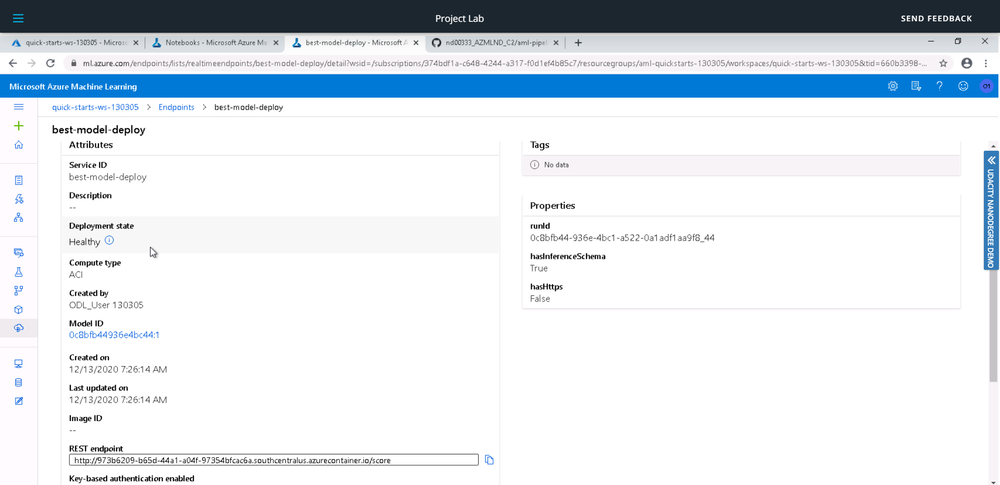
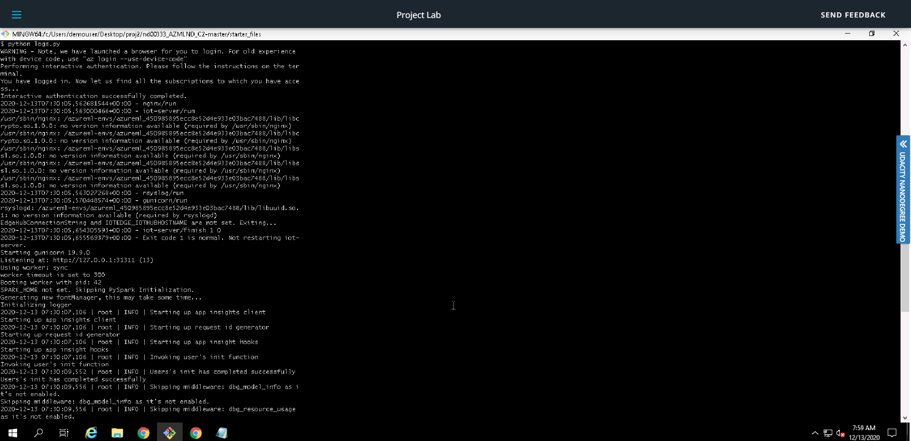
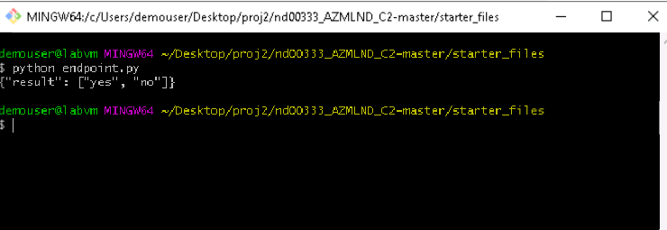

# Operationalizing Machine Learning

In this project I have used Bank Marketing Dataset and AutoML model for training. The best model was deployed and consumed. In later steps, a pipeline was also created, published and consumed.
Steps followed in this project are:
- Step 1 - Authentication
- Step 2 - Auto ML Experiment
- Step 3 - Deploy the Best Model
- Step 4 - Enable Logging
- Step 5 - Swagger Documentation
- Step 6 - Consume Model Endpoints
- Step 7 - Create and Publish a Pipeline

## Architectural Diagram

## Key Steps
**Step 1. Authentication:**

A service principal needs to be created here. As I used Udacity lab, this was already taken care of.

**Step 2. Auto ML Experiment:**

Firstly the dataset must be uploaded onto the platform. 

A new compute cluster is configured to run the experiment. Then an AutoML run is created which trains various models to find the best one in a short time.

VotingEnsemble model turned out to be the best one as it takes output of various classification models and provides them a weighted vote to decide the best one.

**Step 3. Deploy the best model**

The best model is then deployed as a REST endpoint using Azure Container Instance(ACI) with Authentication enabled.

**Step 4. Enable Logging**

The python logs.py script was used to turn on the Application insights for deployed endpoint and to retrieve the logs.

**Step 5. Swagger Documentation**

In this step a swagger ui docker container is deployed to view swagger documentation for the endpoint. First the swagger.json file is downloaded. The python file serve.py and swagger.sh is used to listen on port 8000. Later the GET and POST request can also be seen on the Swagger UI.  

**Step 6. Consume Model Endpoints**

As the model is now deployed, we can interact with the trained model. The endpoint.py file is used to show that the endpoint is consumed. 

The benchmark.sh file was used against the endpoint to see if any request failed. As seen below all the requests were successful. 

**Step 7 - Create and Publish a Pipeline**

In this step the azure pipeline is created to train the model and expose it to an endpoint. Jupyter notebook was used for AutoML run after providing config.json file.
The pipeline is then published and consumed.

## Screen Recording
*TODO* Provide a link to a screen recording of the project in action. Remember that the screencast should demonstrate:
