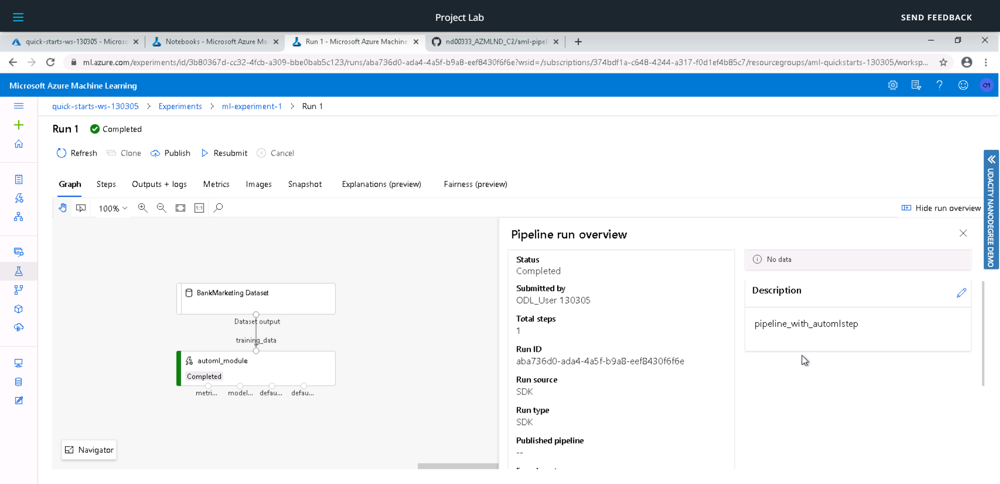
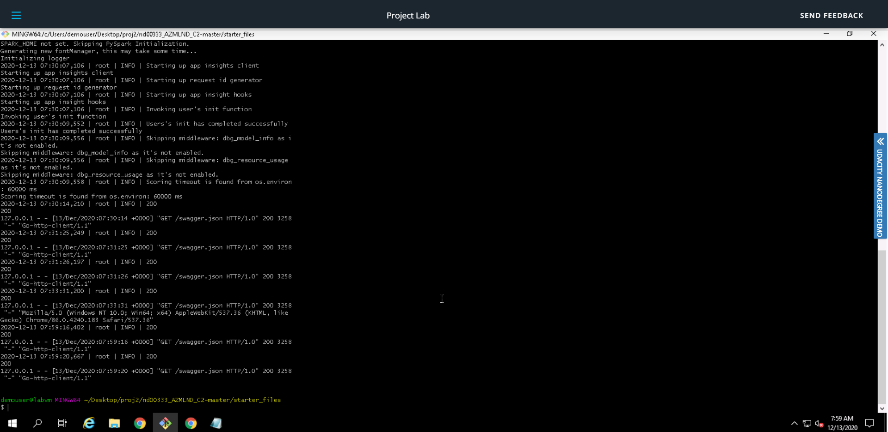
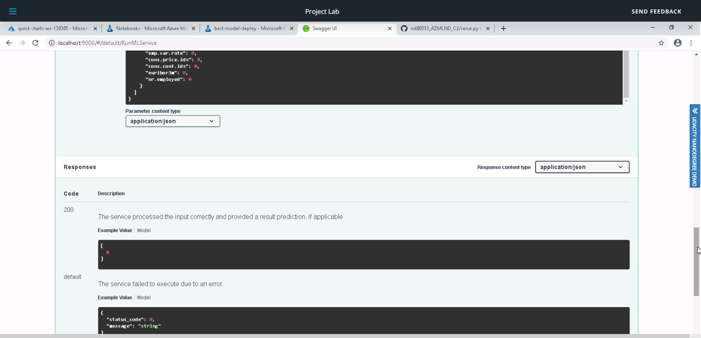
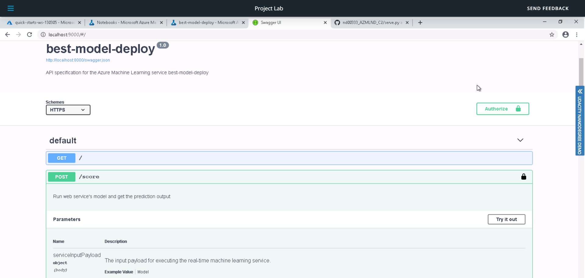
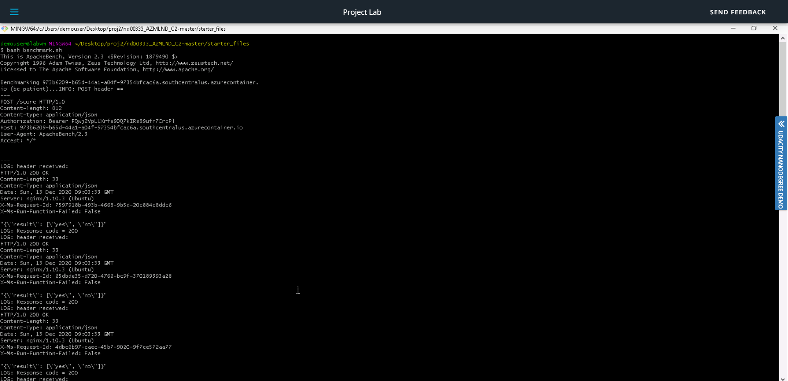
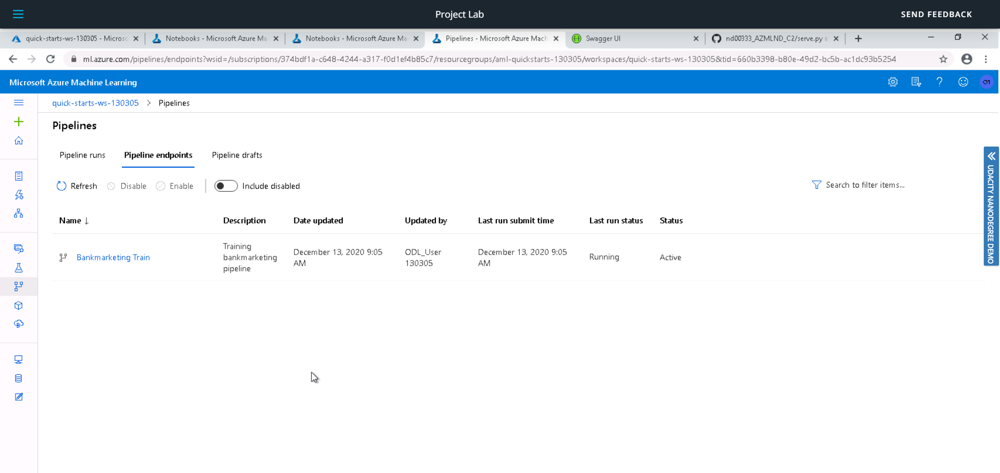

# Operationalizing Machine Learning

In this project I have used Bank Marketing Dataset and AutoML model for training. The best model was deployed and consumed. In later steps, a pipeline was also created, published and consumed.
Steps followed in this project are:
- Step 1 - Authentication
- Step 2 - Auto ML Experiment
- Step 3 - Deploy the Best Model
- Step 4 - Enable Logging
- Step 5 - Swagger Documentation
- Step 6 - Consume Model Endpoints
- Step 7 - Create and Publish a Pipeline

## Architectural Diagram

## Key Steps
### Step 1. Authentication:

A service principal needs to be created here. As I used Udacity lab, this was already taken care of.

### Step 2. Auto ML Experiment:

Firstly the dataset must be uploaded onto the platform. 
The Bank Marketing dataset was uploaded in the Azure ML Datastore.

**Dataset**

**Bank Marketing dataset uploaded**

A new compute cluster is configured to run the experiment. Then an AutoML classification experiment is created which trains various models to find the best one in a short time. This is done to find the best model having high accuracy.

**Completed Experiment**

After running the AutoML classification experiment, VotingEnsemble model turned out to be the best one as it takes output of various classification models and provides them a weighted vote to decide the best one.

**AutoML run**

**Best Model**

### Step 3. Deploy the best model:

After getting the best model, it was then deployed as a REST endpoint using Azure Container Instance(ACI) with Authentication enabled. After clicking on the Deploy button, the best model is now deployed.

**Deploying the Model**

**Model deployed**

### Step 4. Enable Logging:

After deplying the model, we enabled logging. The python logs.py script was used to turn on the Application insights for deployed endpoint and to retrieve the logs.

**Logs terminal of running endpoint**

**Application Insights enabled is true**

### Step 5. Swagger Documentation:

In this step a swagger ui docker container is deployed to view swagger documentation for the endpoint. First the swagger.json file is downloaded. The python file serve.py and swagger.sh is used to listen on port 8000. Later the GET and POST request can also be seen on the Swagger UI. In below screenshots we can see the Swagger on localhost that also shows the correct JSON format in POST  request and the data type required for each field. 

**Swagger GET Request**

**Swagger POST Request**

### Step 6. Consume Model Endpoints:

As the model is now deployed, we can interact with the trained model. The endpoint.py file is used to show that the endpoint is consumed. The below screenshot shows the response that endpoint returns.

**Endpoint**

The benchmark.sh file was used against the endpoint to see if any request failed. As seen below all the requests were successful. Thus we can see that the endpoint is running fine.

**Benchmark**

### Step 7 - Create and Publish a Pipeline:

In this step the azure pipeline is created to train the model and expose it to an endpoint. All the necessary libraries were imported from Azure SDK. Jupyter notebook was used for AutoML run after providing config.json file.
After setting up the pipeline and running AutoML, the jupyter notebook runs the pipeline to ensure the model is working fine. 

**Pipeline Run**

**Pipeline Endpoint**

After creating the pipeline, it is published to a REST endpoint as shown below:

**Pipeline Completed**

Below screenshot shows the published pipeline endpoint along with the REST url

**Pipeline Run from RunDetails widget in Jupyter Notebook**

## Screen Recording
Link to the screen recording of the project in action: [Video Link](https://www.youtube.com/watch?v=k0mP7QpODu4)

## Future Suggestions
- Collect more data to improve the model accuracy
- Data cleaning and feature engineering will be helpful in improving data quality
- Try different models with hypertuned parameneters

